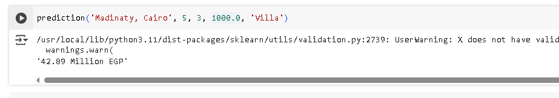

# Egypt Real Estate Price Predictor

A machine learning-powered application that predicts real estate prices across Egypt using advanced regression algorithms. This project analyzes various property features and market factors to provide accurate price estimates for residential and commercial properties in Egyptian cities.

## Overview

The Egyptian real estate market has experienced significant growth and volatility in recent years. This predictor leverages historical property data, location metrics, and economic indicators to help buyers, sellers, and investors make informed decisions about property values across different governorates and neighborhoods in Egypt.

## Features

- Accurate Price Predictions
- Multi-Location Support
- etc...

## Technology Stack

- Python: Core programming language
- Pandas & NumPy: Data manipulation and analysis
- Scikit-learn: Machine learning algorithms and model evaluation
- Matplotlib & Seaborn: Data visualization
- Flask/Django: Web application framework (if applicable)
- Jupyter Notebooks: Data exploration and model development

## Usage

Input property details such as location,bedrooms, bathd, size(sqm), type

## License

This project is open source and available under the MIT License.
